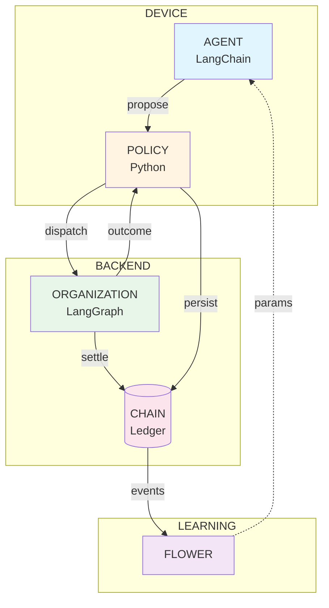
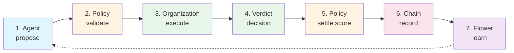
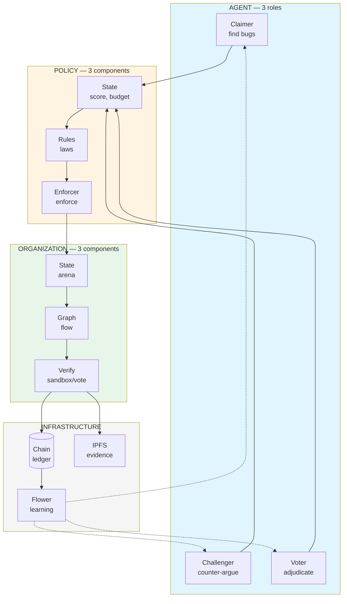

# Overall architecture:



# Flow



# Components



# Folder structure

```text
OFMIS/
├── pyproject.toml                    # Initialize project
├── README.md
├── default.nix
├── docker-compose.yml
├── .gitignore
├── .env.example                      # template for environment variables
│
├── configs/                          # configs for simulation and experiments
│   ├── default.yaml
│   ├── scenarios/
│   │   ├── honest_only.yaml
│   │   ├── with_farmers.yaml
│   │   └── with_collusion.yaml
│   └── rules.yaml                    # Policy rules (advance, clawback, etc.)
│
├── assets/
│   └── flow.drawio.png
│
├── src/
│   └── ofmis/                        # main package
│       │
│       ├── __init__.py
│       ├── config.py                 # load config from configs/
│       ├── logging.py                # structured logging setup
│       ├── errors.py                 # custom exceptions
│       │
│       ├── shared/                   # shared types & clients
│       │   ├── __init__.py
│       │   ├── types.py              # Claim, Challenge, Vote, Verdict, AgentState
│       │   ├── schemas.py            # Pydantic models for validation
│       │   └── clients/
│       │       ├── __init__.py
│       │       ├── chain.py          # blockchain client
│       │       ├── ipfs.py           # IPFS client
│       │       ├── sandbox.py        # sandbox client (Docker/E2B)
│       │       └── flower.py         # Flower client
│       │
│       ├── agent/                    # MICRO LAYER
│       │   ├── __init__.py
│       │   ├── base.py               # BaseAgent class
│       │   ├── claimer.py            # ClaimerAgent
│       │   ├── challenger.py         # ChallengerAgent
│       │   ├── voter.py              # VoterAgent
│       │   ├── tools/                # LangChain tools
│       │   │   ├── __init__.py
│       │   │   ├── scan.py           # scan_code, static analysis
│       │   │   ├── poc.py            # create_poc, verify_poc
│       │   │   ├── submit.py         # submit_claim
│       │   │   ├── challenge.py      # challenge
│       │   │   └── vote.py           # vote
│       │   ├── prompts/              # prompt templates
│       │   │   ├── __init__.py
│       │   │   ├── claimer.txt
│       │   │   ├── challenger.txt
│       │   │   └── voter.txt
│       │
│       ├── policy/                   # CONSTRAINT LAYER
│       │   ├── __init__.py
│       │   ├── state.py              # AgentState class
│       │   ├── rules.py              # Rules class (loaded from configs/rules.yaml)
│       │   ├── enforcer.py           # validate + apply logic
│       │   ├── storage.py            # persistence (cache + chain)
│       │   └── decay.py              # decay function
│       │
│       ├── organization/             # MACRO LAYER
│       │   ├── __init__.py
│       │   ├── state.py              # ArenaState (TypedDict)
│       │   ├── graph.py              # build_graph() → CompiledGraph
│       │   ├── nodes/                # LangGraph nodes
│       │   │   ├── __init__.py
│       │   │   ├── claim.py          # node_claim
│       │   │   ├── challenge.py      # node_challenge
│       │   │   ├── verify.py         # node_verify (sandbox or vote)
│       │   │   ├── settle.py         # node_settle (clawback)
│       │   │   ├── penalty.py        # node_penalty (throttle/freeze)
│       │   │   └── fl.py             # node_fl (push to Flower)
│       │   ├── routers.py            # routing functions
│       │   └── checkpointer.py       # checkpointer setup (MemorySaver/Postgres)
│       │
│       ├── learning/                 # LEARNING LAYER
│       │   ├── __init__.py
│       │   ├── client.py             # Flower client wrapper
│       │   ├── aggregation.py        # weighted aggregation
│       │   └── unlearning.py         # clawback handling
│       │
│       └── observability/            # OBSERVABILITY LAYER (optional)
│           ├── __init__.py
│           ├── tracer.py             # LangSmith wrapper
│           └── metrics.py            # custom metrics
│
├── simulation/                       # SIMULATION
│   ├── __init__.py
│   ├── runner.py                     # main simulation loop
│   ├── environment.py                # mock codebase, bugs
│   ├── agent_factory.py              # create agents by type
│   ├── strategies/                   # agent strategies
│   │   ├── __init__.py
│   │   ├── honest.py
│   │   ├── farmer.py
│   │   ├── lazy.py
│   │   └── adversarial.py
│   └── metrics.py                    # metrics collection
│
├── scripts/                          # entry points
│   ├── run_simulation.py             # run a single simulation
│   ├── run_experiment.py             # run batch experiments
│   ├── deploy_chain.py               # deploy local chain
│   ├── pull_models.py                # pull Ollama models
│   └── analyze_results.py            # analyze results
│
├── tests/                            # UNIT TESTS
│   ├── __init__.py
│   ├── conftest.py                   # fixtures
│   ├── unit/
│   │   ├── test_policy.py
│   │   ├── test_enforcer.py
│   │   ├── test_agent.py
│   │   └── test_rules.py
│   ├── integration/
│   │   ├── test_graph.py
│   │   ├── test_dispute_flow.py
│   │   └── test_clawback.py
│   └── e2e/
│       └── test_full_simulation.py
│
├── notebooks/                        # Jupyter notebooks
│   ├── 01_explore_results.ipynb
│   ├── 02_visualize_metrics.ipynb
│   └── 03_compare_scenarios.ipynb
│
└── data/                             # data (mostly gitignored)
    ├── .gitkeep
    ├── results/                      # simulation results
    └── models/                       # trained models
```
